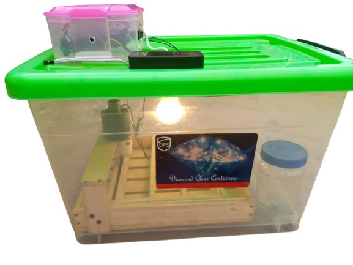

# IoT Automatic Egg Incubator

 The IoT Automatic Egg Incubator is similar to the type of incubator which can be used as a substitute of poultry chicken to incubate the chicken eggs automatically. It will be helpful for the farmers to incubate their eggs automatically without the need of human intervention, by keeping the physical quantities such as temperature and humidity at required level, so that the fetuses inside them will grow and incubates without the presence of the mother.This project is made up of Hardware and Mobile app.

    
 The Hardware part consist of 
 - ESP32
 - DHT22
 - Real Time Clock
 - Three Channel Relay
 - PC Fan
 - 100 watt Bulb
 - Lamp holder
 - Connecting wires
 - Stepper motor
 - Wood and nail
 - Plugs plastic containers
 - small bows
 
  The Mobile app on is built with flutter and the following packages were used:
 - syncfusion_flutter_charts: ^18.1.48
 - path_provider: ^1.6.5
 - sqflite: ^1.3.0
 - mqtt_client: ^5.6.2
 - getflutter: ^1.0.11
 - csv: ^4.0.3
 - permission_handler: ^5.0.0+hotfix.9
 - ext_storage: ^1.0.3
 - open_file: ^3.0.1

 The ESP 32 is programmed with arduino IDE while the mobile app is built with flutter using Android Studio.  

## Programming the Micro-controller. 
The following steps must be follow in order to program the ESP.
1. Install ESP 32 to Arduino Sketch from the instruction at <https://github.com/espressif/arduino-esp32/blob/master/docs/arduino-ide/boards_manager.md>
2. Install the following libraries:
    - AsyncMQTT from the instruction at <https://randomnerdtutorials.com/esp32-mqtt-publish-ds18b20-temperature-arduino/>

    - LiquidCrystal from the instruction at <https://randomnerdtutorials.com/esp32-esp8266-i2c-lcd-arduino-ide/>
    - RTCLib from the instruction at <https://github.com/adafruit/RTClib> or <http://www.esp32learning.com/code/esp32-and-ds3231-rtc-example.php>
    - DHT22 Library from the instruction at <https://randomnerdtutorials.com/esp32-dht11-dht22-temperature-humidity-sensor-arduino-ide/>

3. Follow the fritzing diagram below to connect all the sensors  
     
    - The GND of all the sensors or the module are connected to the GND of the ESP32 Board.
    - The VCC of all the sensors or module are connected to the 5V power pin of the ESP 32 Board.
    - The Data of the DHT22 is connected to pinout 17 of the ESP 32 Board.
    - The signal of Relay channel 1 is connected to pinout 16 of the ESP 32 Board.
    - The signal of Relay channel 2 is connected to pinout 27 of the ESP 32 Board. 
    - The signal of Relay channel 3 is connected to pinout 14 of the ESP 32 Board.
    - The SDA of the Real Time Clock is connected to SDA pinout of the ESP 32 Board.
    - The SCL of the Real Time Clock is connected to SCl pinout of the ESP 32 Board.
    - The SDA of the LCD is connected to SDA pinout of the ESP 32 Board.
    - The SCL of the LCD is connected to SCl pinout of the ESP 32 Board.
    - The MoSI pin of the SD Card Module is connected to pin 5 of the ESP 32 board.
    - The CS pin of the SD Card Module is connected to pin 23 of the ESP 32 board.
    - The CLK pin of the SD Card Module is connected to pin 18 of the ESP 32 board.
    - The  MISO pin of the SD Card Module is connected to pin 19 of the ESP 32 board.
    
4. Clone this repo, extra with 7z and upload the code in the ESP 32 Code folder to the ESp 32 Development Board using th Arduino IDE

5. Follow the youtube at <https://www.youtube.com/watch?v=vQLrBNHcAcs> to build the turning tray.

6. Fix the PC Fan and the bulb at appropriate location in the plastic container
  
7. Provide external power source for the PC Fan, Bulb and the rotating motor or stepper motor depending on your pc fan and motor. 
 

## Building the Mobile App.
 The following steps must be follow to built the Mobile App. 
1. Cone this repo, extra with 7z.
2. Install Android studio and flutter from <https://flutter.dev/docs/get-started/install>
3. Open the iot_egg_incubator_app with android Studio.
4. Click on the terminal in the Android Studio. 
5. Type the command "pub get" and press enter to install all the package dependencies.
6. Build the app to complete this process. 

## Getting A Broker
1. Create a personal gmail for this project.
2. Visit <http://www.dioty.co/>
3. Create an account with the email created. A password will be sent to the inbox/spam of the email created. 
4. Use that password and the email address in your Arduino Sketch ESP 32 code
5. Use that same credential when logining to the mobile. 

 ## Mobile App Screenshot
 Here Are the screenshot for the mobile app

   

  

   

   

   

   